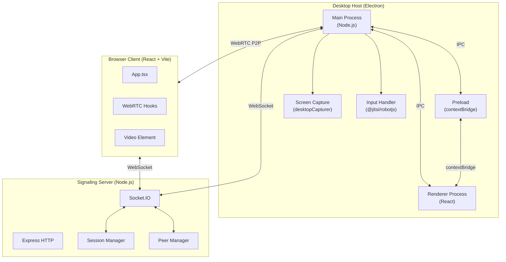

# Architecture — Remote Desktop App

This document describes the technical architecture of the Remote Desktop App: a WebRTC-based screen sharing system built as a TypeScript monorepo.

---

## Table of Contents

- [Overview](#overview)
- [Monorepo Structure](#monorepo-structure)
- [System Architecture](#system-architecture)
- [Connection Flow](#connection-flow)
- [IPC Communication (Electron)](#ipc-communication-electron)
- [WebRTC Data Flow](#webrtc-data-flow)
- [Socket.IO Event Reference](#socketio-event-reference)
- [Input Control Pipeline](#input-control-pipeline)
- [Peer Roles](#peer-roles)
- [Session Management](#session-management)
- [Key Design Decisions](#key-design-decisions)

---

## Overview

```
┌─────────────────────────────────────────────────────────────────┐
│                     Remote Desktop App                          │
│                                                                 │
│  ┌──────────────┐    WebSocket    ┌──────────────┐             │
│  │   Desktop    │◄──────────────►│   Server     │             │
│  │  (Electron)  │   (Signaling)  │  (Socket.IO) │             │
│  └──────┬───────┘                └──────┬───────┘             │
│         │                               │                       │
│         │      WebRTC P2P (direct)      │  WebSocket           │
│         │◄─────────────────────────────►│◄────────────────────►│
│         │                               │  ┌──────────────┐    │
│         │                               │  │   Browser    │    │
│         │◄──────────────────────────────┼──│   (React)    │    │
│         │       WebRTC P2P              │  └──────────────┘    │
└─────────────────────────────────────────────────────────────────┘
```

The server acts **only as a signaling relay** — once WebRTC negotiation is complete, all video and input data flows **peer-to-peer** between the desktop host and browser clients.

---

## Monorepo Structure

```
remote dekstop/
├── packages/
│   ├── shared/          ← @remote-app/shared
│   │   └── src/
│   │       ├── types.ts      ← All TypeScript interfaces
│   │       ├── constants.ts  ← Socket events, ICE servers, config
│   │       ├── utils.ts      ← Session code generation, validation
│   │       └── index.ts      ← Public exports
│   │
│   ├── server/          ← @remote-app/server
│   │   └── src/
│   │       ├── index.ts          ← Express + Socket.IO entry point
│   │       ├── session-manager.ts ← Session lifecycle management
│   │       └── peer-manager.ts   ← Connected peer tracking
│   │
│   ├── desktop/         ← @remote-app/desktop
│   │   └── src/
│   │       ├── main/
│   │       │   ├── index.ts        ← Electron main process
│   │       │   ├── capture.ts      ← Screen capture (desktopCapturer)
│   │       │   ├── signaling.ts    ← Socket.IO client
│   │       │   ├── webrtc-host.ts  ← RTCPeerConnection (host side)
│   │       │   └── input-handler.ts ← robotjs input injection
│   │       ├── preload/
│   │       │   └── index.ts        ← Electron contextBridge API
│   │       └── renderer/
│   │           └── App.tsx         ← React UI (session code display)
│   │
│   └── client/          ← @remote-app/client
│       └── src/
│           ├── App.tsx             ← Root component + routing
│           ├── components/         ← UI components
│           └── hooks/              ← WebRTC, signaling, input hooks
│
├── package.json         ← Root workspace (pnpm)
└── pnpm-workspace.yaml
```

---

## System Architecture



---

## Connection Flow

The full connection sequence from host registration to active session:

```
Desktop (Electron)                Server (Socket.IO)           Browser (React)
      │                                  │                           │
      │── register-host ────────────────►│                           │
      │◄─ register-host-response ────────│ { sessionCode: "ABC-DEF" }│
      │                                  │                           │
      │                                  │◄── join-session ──────────│
      │                                  │─── join-session-response ►│
      │◄── peer-joined ─────────────────│    { hostId, peerId }      │
      │                                  │                           │
      │── offer (SDP) ─────────────────►│─── offer ────────────────►│
      │◄── answer (SDP) ────────────────│◄── answer ────────────────│
      │◄──► ice-candidate ─────────────►│◄──► ice-candidate ────────│
      │                                  │                           │
      │◄═══════════ WebRTC P2P (video stream + DataChannel) ════════►│
      │                                  │                           │
      │◄── [DataChannel: input events] ──────────────────────────────│
```

---

## IPC Communication (Electron)

The Electron main process communicates with the renderer via IPC channels exposed through `contextBridge`:

```
Main Process                    Renderer Process (React)
     │                               │
     │◄── renderer-ready ────────────│  (renderer signals it's ready)
     │─── session-code ─────────────►│  (display session code to user)
     │─── peer-joined ──────────────►│  (update UI: peer connected)
     │◄── signal-offer ──────────────│  (forward SDP offer to server)
     │─── signal-answer ────────────►│  (forward SDP answer from server)
     │◄── handle-input ──────────────│  (input event from DataChannel)
```

The `preload/index.ts` exposes a typed `window.electronAPI` object via `contextBridge.exposeInMainWorld`, ensuring renderer code cannot access Node.js APIs directly.

---

## WebRTC Data Flow

```
Desktop Host                                    Browser Client
┌─────────────────────────────┐    ┌─────────────────────────────┐
│  RTCPeerConnection (host)   │    │  RTCPeerConnection (client)  │
│                             │    │                              │
│  addTrack(videoStream)  ────┼────┼──► ontrack → <video>        │
│                             │    │                              │
│  DataChannel "input"    ◄───┼────┼─── send(InputMessage)       │
│       │                     │    │                              │
│       ▼                     │    └─────────────────────────────┘
│  input-handler.ts           │
│  (@jitsi/robotjs)           │
│  - mouse.move(x, y)         │
│  - mouse.click(x, y, btn)   │
│  - keyboard.keyTap(key)     │
└─────────────────────────────┘
```

**Video stream**: `desktopCapturer` → `getUserMedia` → `MediaStreamTrack` → `addTrack` → WebRTC video track → `<video>` element in browser.

**Input stream**: Browser captures mouse/keyboard events → serializes to `InputMessage` → sends via DataChannel → Electron main process receives → `@jitsi/robotjs` injects OS-level input.

---

## Socket.IO Event Reference

All event names are defined in `@remote-app/shared/src/constants.ts` as `SOCKET_EVENTS`.

### Client → Server

| Event | Payload | Description |
|---|---|---|
| `register-host` | `{ expiresInMs: number \| null }` | Register as a desktop host, create a session |
| `join-session` | `{ sessionCode: string, role: 'admin' \| 'viewer' }` | Join an existing session |
| `offer` | `{ targetId, senderId, signal: SDPPayload }` | Relay WebRTC SDP offer |
| `answer` | `{ targetId, senderId, signal: SDPPayload }` | Relay WebRTC SDP answer |
| `ice-candidate` | `{ targetId, senderId, signal: ICEPayload }` | Relay ICE candidate |

### Server → Client

| Event | Payload | Description |
|---|---|---|
| `register-host-response` | `{ sessionCode: string, hostId: string }` | Session created successfully |
| `join-session-response` | `{ hostId, peerId, viewers: string[] }` | Successfully joined session |
| `peer-joined` | `{ peerId: string, role: PeerRole }` | New peer connected (sent to host) |
| `peer-left` | `{ peerId: string }` | Peer disconnected |
| `offer` | `{ targetId, senderId, signal }` | Relayed SDP offer |
| `answer` | `{ targetId, senderId, signal }` | Relayed SDP answer |
| `ice-candidate` | `{ targetId, senderId, signal }` | Relayed ICE candidate |
| `session-expired` | `{}` | Session TTL reached, all clients disconnected |
| `error` | `{ code: string, message: string }` | Error response |

### Error Codes

| Code | Meaning |
|---|---|
| `SESSION_NOT_FOUND` | Session code does not exist |
| `SESSION_EXPIRED` | Session TTL has elapsed |
| `SESSION_FULL` | Admin slot already taken |
| `INVALID_CODE` | Malformed session code |
| `PEER_NOT_FOUND` | Target peer not connected |
| `HOST_ALREADY_EXISTS` | Another host registered with same socket |
| `ADMIN_ALREADY_EXISTS` | Admin role already occupied in session |

---

## Input Control Pipeline

```
Browser (React)
  │
  │  Mouse/Keyboard DOM events
  ▼
InputMessage serialization
  { t: 'mouse-move', x: 0.5, y: 0.3, ts: 1234567890 }
  │
  │  WebRTC DataChannel "input"
  ▼
Electron Main Process (input-handler.ts)
  │
  │  Deserialize + validate
  ▼
@jitsi/robotjs
  ├── mouse.move(screenX, screenY)
  ├── mouse.click(x, y, button)
  ├── mouse.scroll(x, y, magnitude)
  ├── keyboard.keyTap(key)
  └── keyboard.keyToggle(key, 'down'/'up')
```

**Coordinate normalization**: Browser sends normalized coordinates (0.0–1.0). The host maps these to actual screen pixel coordinates using the screen resolution at the time of the event.

**Throttling**: Mouse move events are throttled to 30 events/sec and scroll events to 20 events/sec (configured in `INPUT_THROTTLE` constants) to prevent DataChannel saturation.

---

## Peer Roles

| Role | Can View | Can Control | Notes |
|---|---|---|---|
| `host` | — | — | Desktop being shared; registered by Electron app |
| `admin` | ✅ | ✅ | Full mouse + keyboard control; one per session |
| `viewer` | ✅ | ❌ | Watch-only; multiple viewers allowed |

---

## Session Management

Sessions are managed in-memory by `session-manager.ts`:

- **Session code format**: `ABC-DEF-GHI` — 3 segments × 3 characters, using unambiguous charset (`ABCDEFGHJKLMNPQRSTUVWXYZ23456789`)
- **Default TTL**: 10 minutes (`SESSION_EXPIRY.DEFAULT_MS`)
- **Expiry behavior**: Server emits `session-expired` to all connected peers, then disconnects them
- **Host disconnect**: If the host disconnects, all peers receive `peer-left` and the session is removed
- **Peer disconnect**: Host receives `peer-left`; session continues

---

## Key Design Decisions

### ADR-001: WebRTC for Video Streaming

**Decision**: Use WebRTC (`RTCPeerConnection`) for video streaming instead of WebSocket-based streaming.

**Rationale**: WebRTC provides hardware-accelerated encoding, adaptive bitrate, and sub-100ms latency. WebSocket streaming would require manual encoding and would not scale to high frame rates.

**Trade-off**: Requires STUN/TURN infrastructure for NAT traversal.

---

### ADR-002: Socket.IO for Signaling Only

**Decision**: The server only relays WebRTC signaling messages (SDP offers/answers, ICE candidates). No video data passes through the server.

**Rationale**: Keeps server load minimal and ensures P2P performance. The server is stateless relative to media.

**Trade-off**: Clients behind symmetric NAT may fail to connect without a TURN server.

---

### ADR-003: pnpm Workspaces Monorepo

**Decision**: Use pnpm workspaces to manage all packages in a single repository.

**Rationale**: Shared types (`@remote-app/shared`) are consumed by all three packages. A monorepo ensures type consistency and simplifies local development without publishing to npm.

**Trade-off**: Requires pnpm ≥ 8; not compatible with npm/yarn without changes.

---

### ADR-004: Electron contextBridge for IPC

**Decision**: All IPC between main and renderer processes goes through `contextBridge.exposeInMainWorld`.

**Rationale**: Follows Electron security best practices. `nodeIntegration: false` prevents renderer from accessing Node.js APIs directly, reducing XSS attack surface.

---

### ADR-005: @jitsi/robotjs for Input Injection

**Decision**: Use `@jitsi/robotjs` (a maintained fork of `robotjs`) for OS-level input injection.

**Rationale**: Provides cross-platform mouse and keyboard control at the OS level, bypassing application-level focus requirements.

**Trade-off**: Requires native module compilation with Visual Studio Build Tools; must be rebuilt for each Electron version using `@electron/rebuild`.
